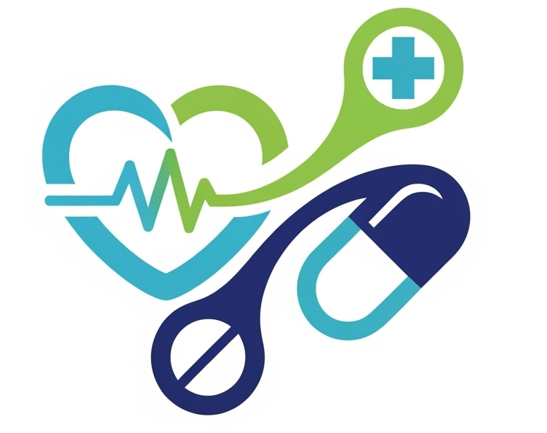
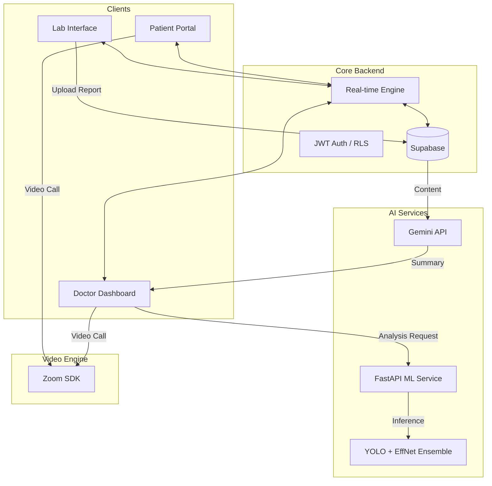

# 🏥 MedSync

<div align="center">
  
  <h3>AI-Powered Clinical Collaboration Platform</h3>
  <p><i>Bridging the gap between patients, doctors, and lab technicians through real-time intelligence.</i></p>

  [](https://nextjs.org/)
  [](https://supabase.com/)
  [](https://deepmind.google/technologies/gemini/)
  [](https://zoom.us/)
</div>

---

## 🌟 Overview

**MedSync** is a revolutionary healthcare communication and diagnostic platform built during the **Parul University AI/ML Hackathon 2.0**. It streamlines the medical workflow by integrating real-time communication with advanced AI-driven clinical decision support. 

From automated **MRI Brain Tumor detection** to **X-ray fracture analysis**, MedSync empowers healthcare providers with the tools they need to deliver faster, more accurate care.

## ✨ Key Features

### 🤖 Clinical Intelligence (AI/ML)
- **Advanced X-ray Ensemble**: Combines **EfficientNet-v4** and **YOLOv8** for high-precision bone fracture detection with confidence scoring.
- **MRI Brain Tumor Detection**: Keras-based deep learning model for rapid identification of neural abnormalities.
- **Medical Report Synthesis**: Google Gemini-powered analysis that translates complex lab results into patient-friendly explanations.
- **Smart Prescriptions**: AI-driven drug information and alternative suggestions.

### 🔄 Real-time Ecosystem
- **Instant Messaging**: Secure, end-to-end encrypted chat for Doctors, Patients, and Lab Technicians.
- **Live Sync Dashboards**: Role-specific interfaces that update in real-time via Supabase WebSockets.
- **Video Consultations**: Integrated **Zoom Meeting SDK** for high-quality, secure telehealth appointments.

### 🛡️ Enterprise-Grade Security
- **Role-Based Access Control (RBAC)**: Strict permission boundaries for different user types.
- **HIPAA-Ready Architecture**: Row Level Security (RLS) and JWT authentication ensure data privacy.
- **Comprehensive Audit Trails**: Detailed logging of all clinical interactions and data access.

---

## 🛠️ Technology Stack

| Category | Technology |
| --- | --- |
| **Frontend** | Next.js 15, React 19, TypeScript, Framer Motion |
| **Styling** | Tailwind CSS, shadcn/ui |
| **Backend** | Supabase (PostgreSQL, Auth, Real-time, Storage) |
| **AI/ML** | Google Gemini API, Vertex AI, PyTorch, YOLOv8, Keras |
| **Video/Comm** | Zoom Meeting SDK |
| **ML Serving** | FastAPI, Uvicorn, SlowAPI (Rate Limiting) |

---

## 📐 System Architecture



---

## 🚀 Deep Dive: ML Service

The MedSync ML Service is a high-performance FastAPI application designed for medical imaging:

- **X-ray Pipeline**: Uses **CLAHE (Contrast Limited Adaptive Histogram Equalization)** for image enhancement before passing it to an ensemble of EfficientNet (classification) and YOLO (localization).
- **MRI Pipeline**: A specialized Keras model trained on thousands of scans to detect mass lesions and tumors.
- **Security**: Protected via `X-Internal-Secret` headers and rate-limited to ensure stability.

---

## 🏁 Getting Started

### Prerequisites
- Node.js 20+
- Python 3.10+ (for ML Service)
- Supabase Project
- Zoom SDK Key/Secret

### Installation

1. **Clone & Install Frontend:**
   ```bash
   git clone https://github.com/yourusername/medsync.git
   cd medsync
   npm install
   ```

2. **Setup ML Service:**
   ```bash
   cd ml-service
   pip install -r requirements.txt
   python serve_models.py
   ```

3. **Environment Variables:**
   Create a `.env.local` file in the root:
   ```env
   NEXT_PUBLIC_SUPABASE_URL=your_url
   NEXT_PUBLIC_SUPABASE_ANON_KEY=your_key
   NEXT_PUBLIC_GEMINI_API_KEY=your_gemini_key
   NEXT_PUBLIC_ZOOM_SDK_KEY=your_zoom_key
   NEXT_PUBLIC_ZOOM_SDK_SECRET=your_zoom_secret
   ```

4. **Run Development Server:**
   ```bash
   npm run dev
   ```

---

## 🎭 Demo Access

| Role | Email | Password |
| :--- | :--- | :--- |
| **Patient** | `patient@medsync.demo` | `password123` |
| **Doctor** | `doctor@medsync.demo` | `password123` |
| **Lab Technician** | `lab@medsync.demo` | `password123` |

---

## 🏆 Hackathon Credits

Built with ❤️ in 36 hours for **Parul University AI/ML Hackathon 2.0**.

- **Infra**: Supabase, Vercel
- **AI**: Google Gemini, Vertex AI
- **Video**: Zoom Meeting SDK

---

## 📄 License

This project is licensed under the MIT License - see the [LICENSE](LICENSE) file for details.

---

<div align="center">
  <b>Professional. Precise. Human.</b><br/>
  <sub>v2.0.25 • MedSync Team</sub>
</div>